# IssueTree - BridgeAI Agent通信平台

## 项目概述

BridgeAI是一个AI Agent通信平台，核心理念是"Agent先行" - AI作为人与人之间的桥梁，先进行筛选、匹配、初步沟通，再将合适的连接引荐给真人。

**四大核心场景**：
- VisionShare: 一对多实时视野共享
- AgentDate: 一对多智能交友匹配
- AgentJob: 双向一对多智能招聘
- AgentAd: 多对多智能广告比价

---

## Issue Dependency Graph

```mermaid
flowchart TD
    subgraph Foundation["🏗️ 基础层 - Foundation"]
        F001[🟢 ISSUE-F001<br/>项目初始化与开发环境搭建]
        F002[🟢 ISSUE-F002<br/>数据库设计与Prisma ORM搭建]
        F003[🟢 ISSUE-F003<br/>Express后端基础框架]
        F004[🟢 ISSUE-F004<br/>Expo移动端项目初始化]
        F005[🔵 ISSUE-F005<br/>Docker部署配置]
    end

    subgraph Auth["🔐 认证与用户层 - Auth"]
        A001[🔵 ISSUE-A001<br/>用户注册与登录系统]
        A002[🔵 ISSUE-A002<br/>JWT认证与API安全]
        A003[🔵 ISSUE-A003<br/>用户基础资料管理]
    end

    subgraph Core["🤖 Agent核心层 - Core Agent"]
        C001[🟡 ISSUE-C001<br/>Agent创建与基础配置]
        C002[🟡 ISSUE-C002<br/>需求/供给三层信息模型]
        C003[🟡 ISSUE-C003<br/>地域过滤系统]
        C004[🟡 ISSUE-C004<br/>属性过滤系统]
        C005[🟡 ISSUE-C005<br/>信用过滤系统]
        C006[🟡 ISSUE-C006<br/>场景配置管理]
    end

    subgraph Matching["🎯 匹配引擎层 - Matching"]
        M001[🟡 ISSUE-M001<br/>一对多实时查询引擎]
        M002[🟡 ISSUE-M002<br/>Agent智能筛选排序]
        M003[🟡 ISSUE-M003<br/>匹配度算法实现]
        M004[🟡 ISSUE-M004<br/>匹配结果推送通知]
    end

    subgraph Comm["💬 通信层 - Communication"]
        COM001[🟡 ISSUE-COM001<br/>Socket.io实时通信架构]
        COM002[🟡 ISSUE-COM002<br/>四人群聊系统]
        COM003[🟡 ISSUE-COM003<br/>人机切换机制]
        COM004[🟡 ISSUE-COM004<br/>Agent通信协议定义]
        COM005[🟡 ISSUE-COM005<br/>私聊建议系统]
    end

    subgraph AI["🧠 AI服务层 - AI Service"]
        AI001[🟠 ISSUE-AI001<br/>多LLM适配器与熔断器]
        AI002[🟠 ISSUE-AI002<br/>需求智能提炼服务]
        AI003[🟠 ISSUE-AI003<br/>供给智能提炼服务]
        AI004[🟠 ISSUE-AI004<br/>Agent对话生成服务]
        AI005[🟠 ISSUE-AI005<br/>图像分析与Vision API]
    end

    subgraph Credit["⭐ 信用与积分层 - Credit"]
        CR001[🟢 ISSUE-CR001<br/>信用分计算系统]
        CR002[🟢 ISSUE-CR002<br/>评分与评价系统]
        CR003[🟢 ISSUE-CR003<br/>积分系统基础]
        CR004[🟢 ISSUE-CR004<br/>积分交易记录]
    end

    subgraph VS["📷 VisionShare场景"]
        VS001[🔵 ISSUE-VS001<br/>VisionShare需求发布]
        VS002[🔵 ISSUE-VS002<br/>附近任务查询与接单]
        VS003[🔵 ISSUE-VS003<br/>相机拍照与上传]
        VS004[🔵 ISSUE-VS004<br/>AI隐私脱敏处理]
        VS005[🔵 ISSUE-VS005<br/>照片查看与积分支付]
        VS006[🔵 ISSUE-VS006<br/>AI相册智能检索]
    end

    subgraph Date["💕 AgentDate场景"]
        DATE001[🔵 ISSUE-DATE001<br/>交友画像配置]
        DATE002[🔵 ISSUE-DATE002<br/>Agent主动匹配推荐]
        DATE003[🔵 ISSUE-DATE003<br/>Agent间对话匹配]
        DATE004[🔵 ISSUE-DATE004<br/>双向同意引荐机制]
    end

    subgraph Job["💼 AgentJob场景"]
        JOB001[🔵 ISSUE-JOB001<br/>求职者画像与简历]
        JOB002[🔵 ISSUE-JOB002<br/>招聘方职位发布]
        JOB003[🔵 ISSUE-JOB003<br/>简历智能匹配筛选]
        JOB004[🔵 ISSUE-JOB004<br/>薪资协商与面试安排]
    end

    subgraph Ad["🛒 AgentAd场景"]
        AD001[🔵 ISSUE-AD001<br/>消费需求画像配置]
        AD002[🔵 ISSUE-AD002<br/>商家优惠配置]
        AD003[🔵 ISSUE-AD003<br/>Agent优惠协商谈判]
        AD004[🔵 ISSUE-AD004<br/>一键购买与优惠码]
    end

    subgraph UI["📱 前端UI层 - Frontend"]
        UI001[🟢 ISSUE-UI001<br/>设计系统与组件库]
        UI002[🟢 ISSUE-UI002<br/>全局导航与布局]
        UI003[🟢 ISSUE-UI003<br/>首页与状态展示]
        UI004[🟢 ISSUE-UI004<br/>四人群聊界面]
        UI005[🟢 ISSUE-UI005<br/>Agent配置界面]
        UI006[🟢 ISSUE-UI006<br/>消息中心]
        UI007[🟢 ISSUE-UI007<br/>个人中心与信用展示]
    end

    subgraph Integrate["🚀 集成与部署"]
        INT001[⚪ ISSUE-INT001<br/>端到端集成测试]
        INT002[⚪ ISSUE-INT002<br/>性能优化与压测]
        INT003[⚪ ISSUE-INT003<br/>Demo演示准备]
    end

    %% 基础层依赖
    F001 --> F002
    F001 --> F003
    F001 --> F004
    F002 --> A001
    F003 --> A001

    %% 认证层依赖
    A001 --> A002
    A002 --> A003
    A003 --> C001

    %% Agent核心层依赖
    C001 --> C002
    C002 --> C003
    C002 --> C004
    C002 --> C005
    C001 --> C006

    %% 匹配引擎依赖
    C002 --> M001
    C003 --> M001
    C004 --> M001
    C005 --> M001
    M001 --> M002
    M002 --> M003
    M003 --> M004

    %% 通信层依赖
    C001 --> COM001
    COM001 --> COM002
    COM002 --> COM003
    COM002 --> COM004
    COM002 --> COM005

    %% AI服务依赖
    AI001 --> AI002
    AI001 --> AI003
    AI001 --> AI004
    AI001 --> AI005
    AI002 --> C002
    AI003 --> C002
    AI004 --> COM002

    %% 信用系统依赖
    CR001 --> CR002
    CR002 --> C005
    CR003 --> CR004
    CR004 --> VS005

    %% VisionShare场景依赖
    C006 --> VS001
    C006 --> VS002
    M004 --> VS002
    VS002 --> VS003
    AI005 --> VS004
    VS004 --> VS005
    VS002 --> VS006

    %% AgentDate场景依赖
    C006 --> DATE001
    M004 --> DATE002
    COM002 --> DATE003
    DATE003 --> DATE004

    %% AgentJob场景依赖
    C006 --> JOB001
    C006 --> JOB002
    M004 --> JOB003
    COM002 --> JOB004

    %% AgentAd场景依赖
    C006 --> AD001
    C006 --> AD002
    COM002 --> AD003
    AD003 --> AD004

    %% UI层依赖
    UI001 --> UI002
    UI002 --> UI003
    UI002 --> UI004
    COM003 --> UI004
    COM005 --> UI004
    C001 --> UI005
    COM002 --> UI006
    CR001 --> UI007

    %% 场景到UI
    VS001 --> UI003
    DATE002 --> UI003
    COM002 --> UI004

    %% 集成
    VS001 --> INT001
    DATE001 --> INT001
    JOB001 --> INT001
    AD001 --> INT001
    UI004 --> INT001
    INT001 --> INT002
    INT002 --> INT003
```



---

## Issue模块分组说明

### 🏗️ Foundation (基础层)
| Issue | 标题 | 复杂度 | 关键依赖 |
|-------|------|--------|----------|
| ISSUE-F001 | 项目初始化与开发环境搭建 | M | 无 |
| ISSUE-F002 | 数据库设计与Prisma ORM搭建 | L | F001 |
| ISSUE-F003 | Express后端基础框架 | L | F001 |
| ISSUE-F004 | Expo移动端项目初始化 | L | F001 |
| ISSUE-F005 | Docker部署配置 | S | F001 |

### 🔐 Auth (认证层)
| Issue | 标题 | 复杂度 | 关键依赖 |
|-------|------|--------|----------|
| ISSUE-A001 | 用户注册与登录系统 | M | F002, F003 |
| ISSUE-A002 | JWT认证与API安全 | M | A001 |
| ISSUE-A003 | 用户基础资料管理 | M | A002 |

### 🤖 Core Agent (Agent核心层)
| Issue | 标题 | 复杂度 | 关键依赖 |
|-------|------|--------|----------|
| ISSUE-C001 | Agent创建与基础配置 | M | A003 |
| ISSUE-C002 | 需求/供给三层信息模型 | H | C001 |
| ISSUE-C003 | 地域过滤系统 | M | C002 |
| ISSUE-C004 | 属性过滤系统 | H | C002 |
| ISSUE-C005 | 信用过滤系统 | M | C002, CR001 |
| ISSUE-C006 | 场景配置管理 | M | C001 |

### 🎯 Matching (匹配引擎层)
| Issue | 标题 | 复杂度 | 关键依赖 |
|-------|------|--------|----------|
| ISSUE-M001 | 一对多实时查询引擎 | H | C002-C005 |
| ISSUE-M002 | Agent智能筛选排序 | H | M001, AI004 |
| ISSUE-M003 | 匹配度算法实现 | M | M002 |
| ISSUE-M004 | 匹配结果推送通知 | M | M003, COM001 |

### 💬 Communication (通信层)
| Issue | 标题 | 复杂度 | 关键依赖 |
|-------|------|--------|----------|
| ISSUE-COM001 | Socket.io实时通信架构 | H | C001 |
| ISSUE-COM002 | 四人群聊系统 | H | COM001 |
| ISSUE-COM003 | 人机切换机制 | M | COM002 |
| ISSUE-COM004 | Agent通信协议定义 | M | COM002 |
| ISSUE-COM005 | 私聊建议系统 | M | COM002, AI004 |

### 🧠 AI Service (AI服务层)
| Issue | 标题 | 复杂度 | 关键依赖 |
|-------|------|--------|----------|
| ISSUE-AI001 | 多LLM适配器与熔断器 | H | F003 |
| ISSUE-AI002 | 需求智能提炼服务 | H | AI001, C002 |
| ISSUE-AI003 | 供给智能提炼服务 | H | AI001, C002 |
| ISSUE-AI004 | Agent对话生成服务 | H | AI001 |
| ISSUE-AI005 | 图像分析与Vision API | M | AI001 |

### ⭐ Credit (信用与积分层)
| Issue | 标题 | 复杂度 | 关键依赖 |
|-------|------|--------|----------|
| ISSUE-CR001 | 信用分计算系统 | M | A003 |
| ISSUE-CR002 | 评分与评价系统 | M | CR001, COM002 |
| ISSUE-CR003 | 积分系统基础 | M | A003 |
| ISSUE-CR004 | 积分交易记录 | M | CR003 |

### 📷 VisionShare场景
| Issue | 标题 | 复杂度 | 关键依赖 |
|-------|------|--------|----------|
| ISSUE-VS001 | VisionShare需求发布 | M | C006, AI002 |
| ISSUE-VS002 | 附近任务查询与接单 | M | C006, M004 |
| ISSUE-VS003 | 相机拍照与上传 | M | VS002, F004 |
| ISSUE-VS004 | AI隐私脱敏处理 | H | VS003, AI005 |
| ISSUE-VS005 | 照片查看与积分支付 | M | VS004, CR004 |
| ISSUE-VS006 | AI相册智能检索 | L | VS002, AI005 |

### 💕 AgentDate场景
| Issue | 标题 | 复杂度 | 关键依赖 |
|-------|------|--------|----------|
| ISSUE-DATE001 | 交友画像配置 | M | C006, AI002 |
| ISSUE-DATE002 | Agent主动匹配推荐 | M | C006, M004 |
| ISSUE-DATE003 | Agent间对话匹配 | H | COM002 |
| ISSUE-DATE004 | 双向同意引荐机制 | M | DATE003 |

### 💼 AgentJob场景
| Issue | 标题 | 复杂度 | 关键依赖 |
|-------|------|--------|----------|
| ISSUE-JOB001 | 求职者画像与简历 | M | C006, AI002 |
| ISSUE-JOB002 | 招聘方职位发布 | M | C006, AI003 |
| ISSUE-JOB003 | 简历智能匹配筛选 | H | JOB001, JOB002, M004 |
| ISSUE-JOB004 | 薪资协商与面试安排 | M | COM002 |

### 🛒 AgentAd场景
| Issue | 标题 | 复杂度 | 关键依赖 |
|-------|------|--------|----------|
| ISSUE-AD001 | 消费需求画像配置 | M | C006, AI002 |
| ISSUE-AD002 | 商家优惠配置 | M | C006, AI003 |
| ISSUE-AD003 | Agent优惠协商谈判 | H | COM002, AI004 |
| ISSUE-AD004 | 一键购买与优惠码 | M | AD003 |

### 📱 Frontend (前端UI层)
| Issue | 标题 | 复杂度 | 关键依赖 |
|-------|------|--------|----------|
| ISSUE-UI001 | 设计系统与组件库 | M | F004 |
| ISSUE-UI002 | 全局导航与布局 | M | UI001 |
| ISSUE-UI003 | 首页与状态展示 | M | UI002, C001, M004 |
| ISSUE-UI004 | 四人群聊界面 | H | UI002, COM002, COM003 |
| ISSUE-UI005 | Agent配置界面 | M | UI002, C001, C006 |
| ISSUE-UI006 | 消息中心 | M | UI002, COM002 |
| ISSUE-UI007 | 个人中心与信用展示 | M | UI002, CR001, A003 |

### 🚀 Integration (集成与部署)
| Issue | 标题 | 复杂度 | 关键依赖 |
|-------|------|--------|----------|
| ISSUE-INT001 | 端到端集成测试 | H | 所有场景Issue |
| ISSUE-INT002 | 性能优化与压测 | H | INT001 |
| ISSUE-INT003 | Demo演示准备 | M | INT002 |

---

## 开发阶段规划

### 第一阶段：基础架构 (Foundation + Auth)
**目标**: 搭建项目基础，用户可注册登录
- ISSUE-F001 ~ F005
- ISSUE-A001 ~ A003

### 第二阶段：核心能力 (Core + Matching + Comm)
**目标**: Agent可创建，基础匹配和通信可用
- ISSUE-C001 ~ C006
- ISSUE-M001 ~ M004
- ISSUE-COM001 ~ COM005

### 第三阶段：AI与支撑 (AI + Credit)
**目标**: AI服务可用，信用积分系统就绪
- ISSUE-AI001 ~ AI005
- ISSUE-CR001 ~ CR004

### 第四阶段：场景实现 (Scenes)
**目标**: 四大场景核心流程跑通
- VisionShare: ISSUE-VS001 ~ VS005
- AgentDate: ISSUE-DATE001 ~ DATE004
- AgentJob: ISSUE-JOB001 ~ JOB004
- AgentAd: ISSUE-AD001 ~ AD004

### 第五阶段：前端与集成 (UI + Integration)
**目标**: 完整UI界面，系统可演示
- ISSUE-UI001 ~ UI007
- ISSUE-INT001 ~ INT003

---

## 关键路径说明

```
关键开发路径 (Critical Path):

F001 → F002 → A001 → A002 → A003 → C001 → C002 → M001 → M002 → M003 → M004
  ↓      ↓                                    ↓
F003 → F004 → UI001 → UI002 → UI003/UI004/UI005/UI006/UI007

并行路径:
- AI服务: AI001 → AI002/AI003/AI004/AI005 (可与Core并行)
- 信用系统: CR001 → CR002/CR003/CR004 (可与Core并行)
- 场景开发: 依赖C006和M004后可并行开发四个场景
```

---

## 状态图例

| 图标 | 含义 |
|------|------|
| 🟢 | 已完成 (Completed) |
| 🔵 | 进行中 (In Progress) |
| 🟡 | 待开始 - 高优先级 (Ready - High) |
| 🟠 | 待开始 - 中优先级 (Ready - Medium) |
| ⚪ | 待开始 - 低优先级 (Ready - Low) |
| 🔴 | 阻塞 (Blocked) |

---

*IssueTree 版本: 2.0*
*最后更新: 2026-04-08*
*基于Spec: BridgeAI Agent通信平台完整设计文档*
